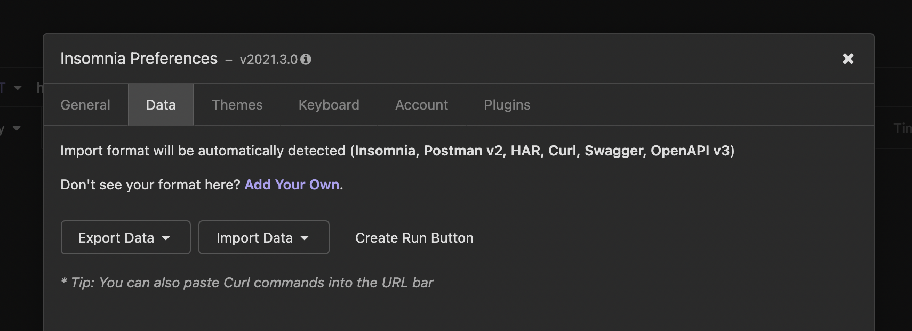

# Kafka-Test

_Servicio para hacer pruebas con Apache Kafka_

## Comenzando 🚀

_Estas instrucciones te permitirán obtener una copia del proyecto en funcionamiento en tu máquina local para pruebas._

### Pre-requisitos 📋

_Herramientas necesarias para correr la aplicación_

```
git version 2.24.3
Apache Maven 3.6.3
java 11.0.10 2021-01-19 LTS (JDK 11)
Docker version 20.10.6
docker-compose version 1.29.1
```

### Construcción 🔧

+ Abrir una terminal y realizar los siguiente pasos.

```
git clone https://github.com/gustavo-9189/kafka-test.git
cd kafka-test
docker-compose up -d
mvn clean package
```
+ _mvn clean package_ construirá la aplicación y ejecutará los tests.

### Correr la aplicación (local) ⚙️

_Desde una terminal, dentro del directorio del proyecto. Realizar los siguientes pasos_

```
mvn spring-boot:run
```
+ Para saber el estado de salud de la aplicación, ir a: http://localhost:8080/actuator/health

### Pruebas con Insomnia REST
_Insomnia es un cliente REST, con el cual se podran realizar pruebas a la API desplegada_
+ Descargarse la herramienta desde https://insomnia.rest/download
+ Instalarla e importar el archivo json [Insomnia.json](./docs/Insomnia.json)
+ Ir a Preferences -> Data -> Import Data



+ Desde esta herramienta podrá probar la aplicación, eligiendo entre el ambiente

## Autor ✒️

* **Gustavo Martínez** - [gustavo-9189](https://github.com/gustavo-9189)